SOLOVYEV

2.3.2

Проверка доктестов

Проверка юниттестов

2.3.3

1-й вариант

С помощью обрезания строки ".".join(date[:4].split("-"))

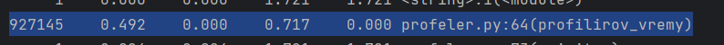

2-й вариант

С помощью big.split('-') new_data = int(year)

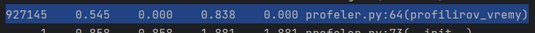

3-й вариант

С помощью datetime.strptime(date, '%Y-%m-%dT%H:%M:%S%z').strftime("%Y")

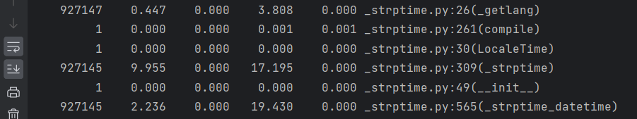

Самый быстрый способ, с помощью обрезания строки ".".join(date[:4].split("-"))

3.2.1

Результат

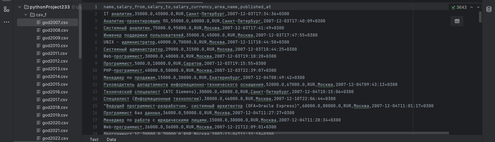

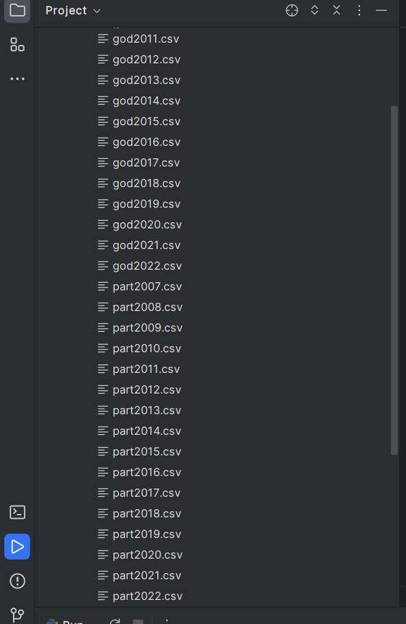

3.3.1

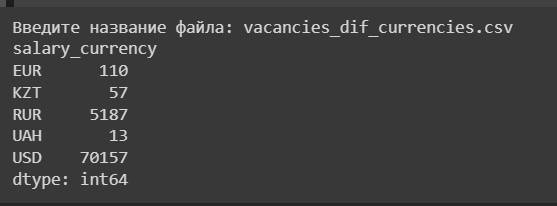

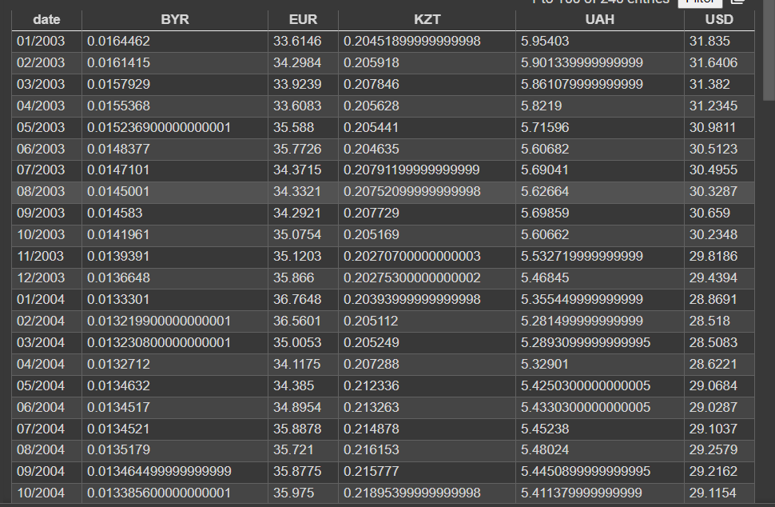

3.3.3

Полученные данные, актуальны на 27.12.2022

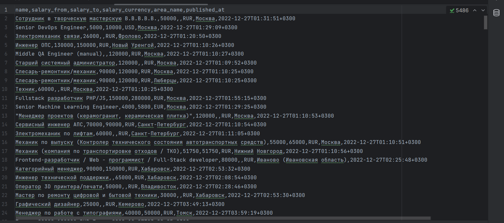

3.4.1

Формат обработанного csv файла:

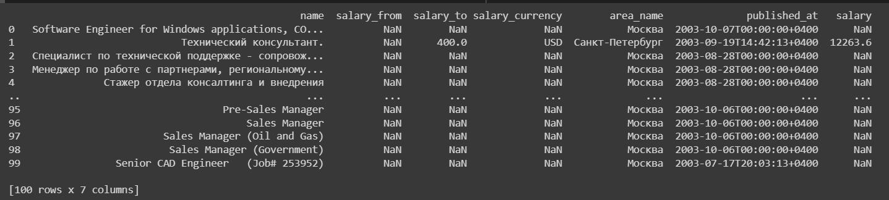

3.5.1

Получившаяся база данных

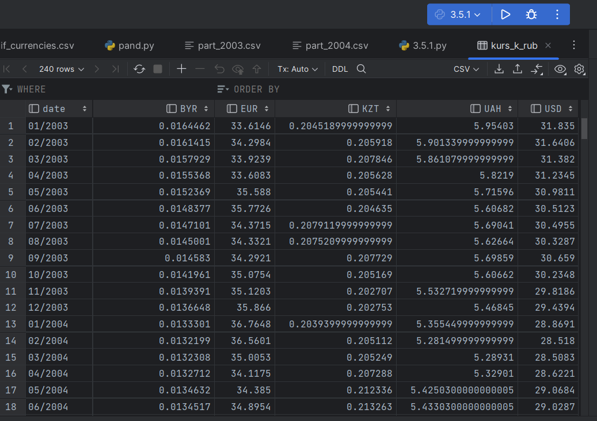

3.5.2

Получившаяся база данных по вакансиям

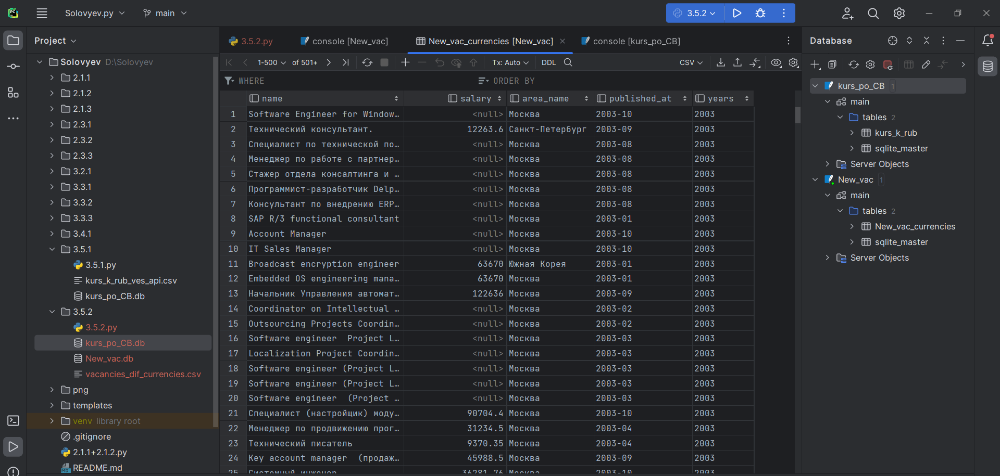

3.5.3

Код, БД и результат вывода

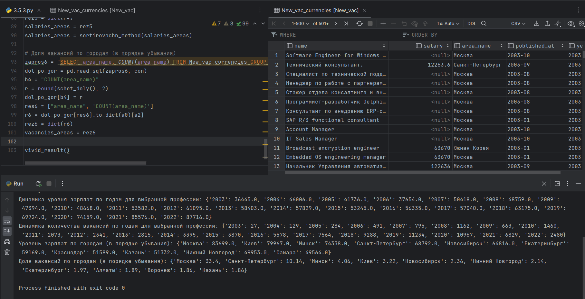
