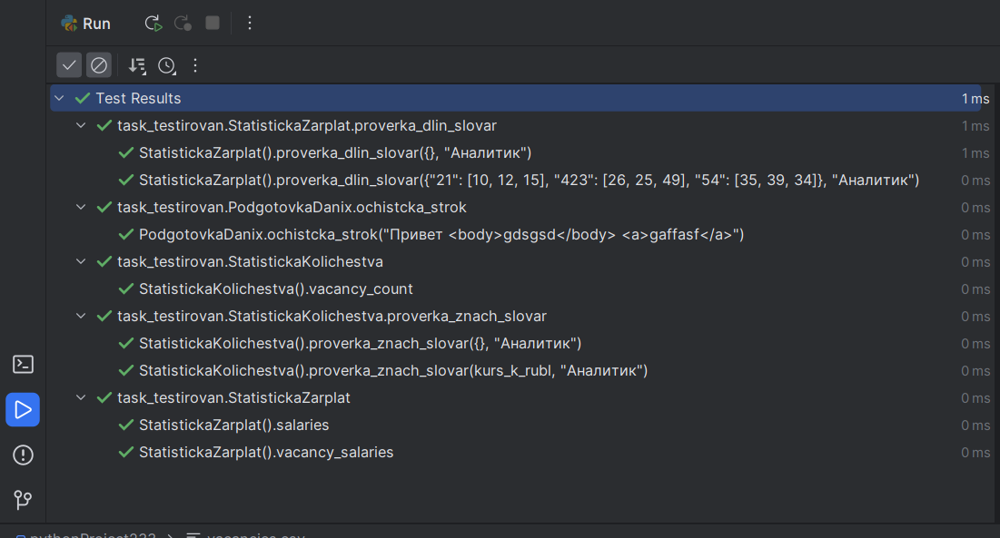

SOLOVYEV

2.3.2

Проверка доктестов

Проверка юниттестов

2.3.3

1-й вариант

С помощью обрезания строки ".".join(date[:4].split("-"))

2-й вариант

С помощью big.split('-') new_data = int(year)

3-й вариант

С помощью datetime.strptime(date, '%Y-%m-%dT%H:%M:%S%z').strftime("%Y")

Самый быстрый способ, с помощью обрезания строки ".".join(date[:4].split("-"))

3.2.1

Результат

3.2.2
